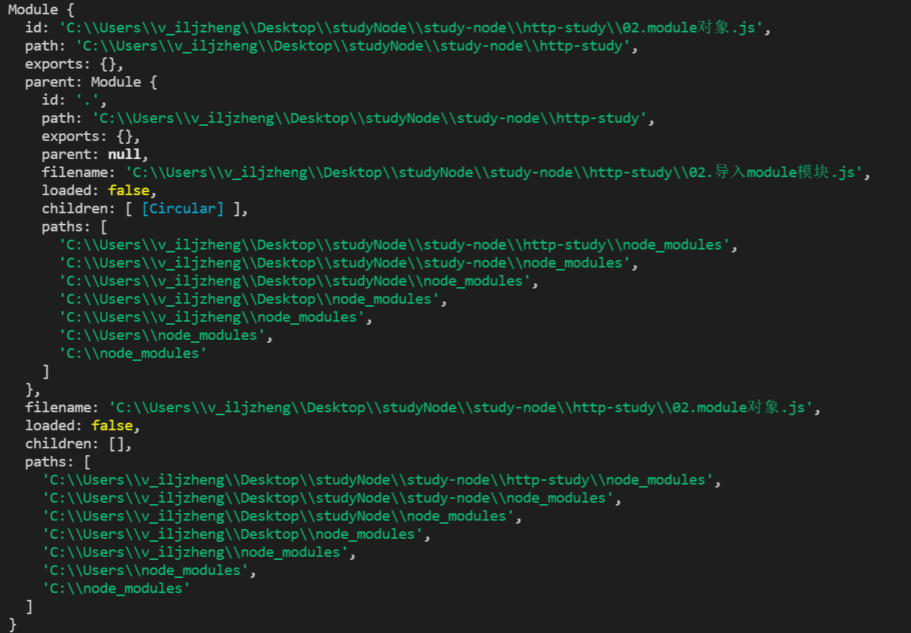
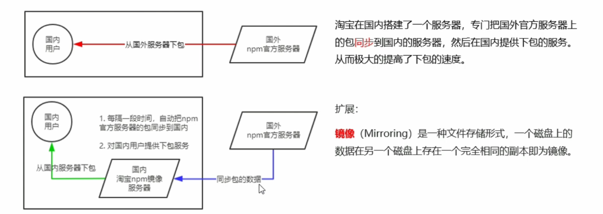
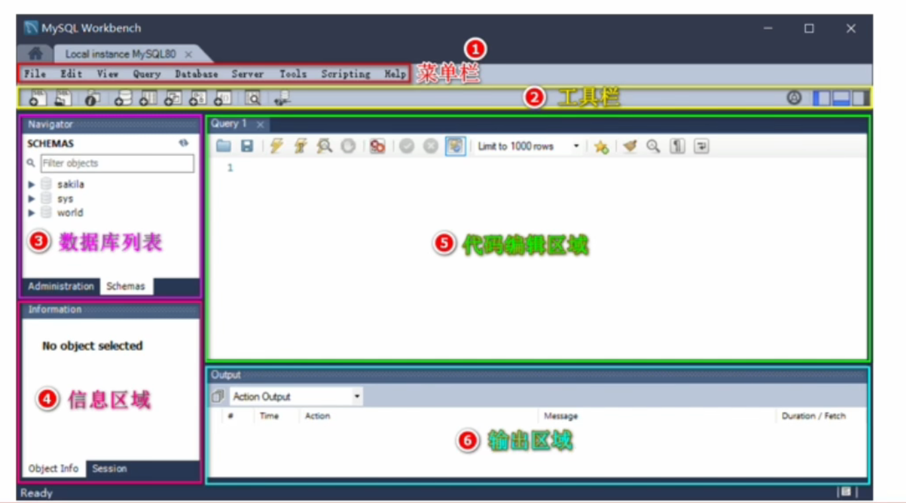
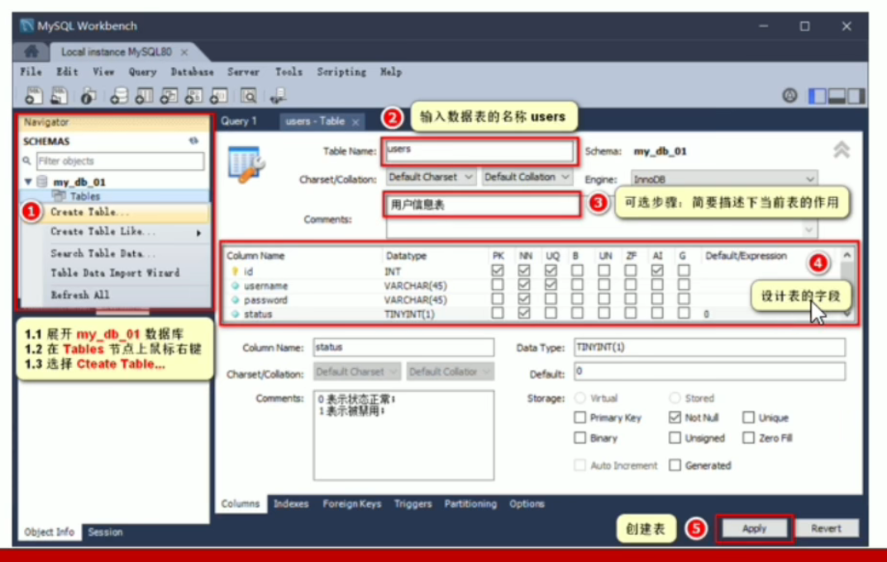
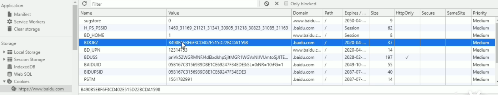
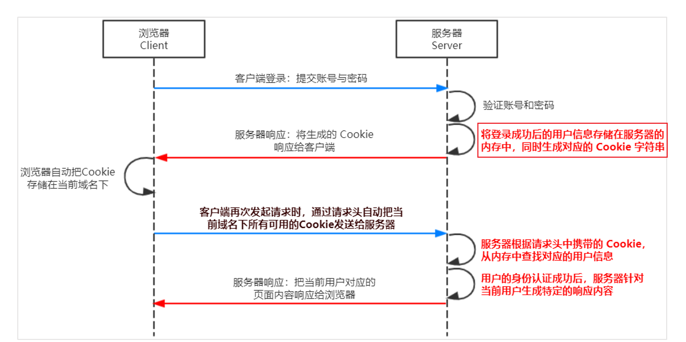
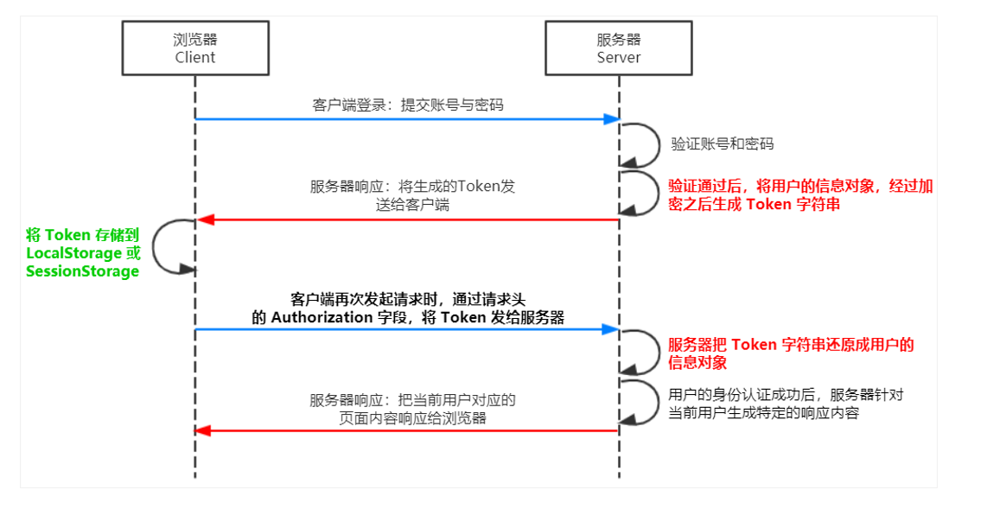

## 1. node知识汇总

- Node.js 是一个基于 Chrome V8 引擎的 `JavaScript 运行环境` 

#### 1.1 如何在 `node.js` 中执行 `JavaScript` 代码

- 打开终端
- 输入**node** 要执行的 js 文件的路由

#### 1.2 什么是 `fs` 文件系统模块

- 在 JavaScript 代码中，使用 fs 模块操作文件，则需要导入

  ```js
  const fa = require('fs');
  ```

- fs.readFile() 方法，用来**读取**指定文件中的内容

  ```js
  const fs = require('fs');
  
  // fs.readFile(path[, options], callback)
  /** 
   * 参数1：必选参数，字符串，表示文件路径
   * 参数2：可选参数，表示一什么编码格式来读取文件   'utf8'
   * 参数3：必选参数，文件读取完成后，通过毁掉函数拿到读取结果
   */
   fs.readFile('./files/text1.txt', 'utf8', (err, dataStr) =>{
    // err 表示失败之后的结果， dataStr 表示成功之后的结果
    // 如果读取成功，则 err 的值为 null；读取失败，则 err 为错误对象， dataStr 为 undefined
    if(err) {
      return console.log('文件写入错误', err.message);
    }
    // 如果读取成功，dataStr 则是打印成功的结果
    console.log(dataStr);
  });
  ```

- fs.writeFile() 方法，用来想指定的文件中**写入**内容

  ```js
  const fs = require('fs');
  
  // fs.writeFile(file, data[, option], callback);
  /**
   * 参数1：必选参数，需要指定一个文件路径的字符串，表示文件的存放路径
   * 参数2：必选参数，表示要写入的内容
   * 参数3：可选参数，表示以什么格式写入文件内容，默认是 utf8
   * 参数4：必选参数，文件写入完成后的回调函数
   */
   fs.writeFile('./files/text2.txt', '我是要添加的内容', function(err){
   // 如果写入成功，则 err 的值为 null
   // 如果写入失败，则 err 的值为错误对象
   if(err) {
   	return console.log('文件写入错误', err.message);
    }
     console.log('文件写入成功');
   });
  ```

- fs.writeFile() 只能用来创建文件，不能用来创建路径

- 重复调用 fs.writeFile() 写入同一个文件，新写入的内容会覆盖之前的旧内容

#### 1.3 文件存放路径的处理方法

- 使用 `__dirname` 进行读取，其表示当前文件所处的目录

  ```js
  const fs = require('fs');
  
  fs.readFile(__dirname + '/files/text1.txt', 'utf8', function(err, dataStr){
    if(err) {
      return console.log('读取文件失败！' + err.message);
    }
    console.log('读取文件成功!', dataStr);
   });
  ```

- `path` 路径模块 (注：今后凡是涉及路径凭借都要使用 path.join() 方法进行处理，不要直接使用 + 进行字符串拼接)

  ```js
  // 在 JavaScript 代码中，使用 path 模块操作文件，则需要导入
  const path = require('path');
  
  const pathStr = path.join('/a', '/b/c', '../', '/d', '/e');
  console.log(pathStr) // 输出 \a\b\c\d\e  注：'../'表示上一级
  
  const pathStr2 = path.join(__dirname, './file/1.txt');
  console.log(pathStr2) // 输出 当前文件所处目录\file\1.text
  ```

- path.basename() 可以从一个文件路径中，获取到文件的名称部分

  ```js
  // path.basename(path[, ext])
  /**
   * 参数1：必选参数，表示一个路径的字符串
   * 参数2：可选参数，表示文件扩张名
   * 返回：表示路径中的最后一部分
   */
  const fpath = '/a/b/c/index.html';
  
  const fullName = path.basename(fname);
  console.log(fullName); // 输出 index.html
  
  const nameWithoutExt = path.basename(fpath, '.html');
  console.log(nameWithoutExt); // 输出 index
  ```

- path.extname() 可以获取路径中的扩展名部分

  ```js
  const path = require('path');
  // path.extname(path);
  /**
   * path：必选参数，表示一个路径的字符串
   * 返回：返回得到的扩展名字符串
   */
  const fpath = '/a/b/c/index.html';
  
  const fext = path.extname(fpath); 
  console.log(fext); // 输出 .html
  ```

#### 1.4 `http` 模块

- 什么是客户端、什么是服务器
  - 在网络节点中，负责消费资源的电脑，叫做客户端
  - 负责对外提供网络资源的电脑，叫做服务器
  
- IP 地址
  - IP 地址就是互联网上每台计算机的唯一地址，因此 IP 地址具有唯一性，如果把"个人电脑" 比作 "一台电话"，那么 "IP 地址" 就相当于 "电话号码" ，只有知道对方 IP 地址的前提下，才能与对应的电脑之间进行数据通信
  - IP 地址的格式：通常用 "点分十进制" 表示成 (a,b,c,d) 的形式，a,b,c,d 都是 0 ~ 255 之间的十进制整数
    - 例如：百度的 IP 地址：在 Window 终端中输入 ping www.baidu.com 就能查看到百度的 IP 地址，IP 地址也能直接访问网页
    - 自己电脑也是一台服务器，自己电脑(web 客户端)访问自己电脑(服务器)，可以在浏览器上输入 127.0.0.1
  - 域名和域名服务器
    - IP 地址和域名是一一对应的关系，这份对应关系存放在一种叫做域名服务器(DNS Domain name serve) 的电脑中，使用者只需通过记好的域名访问对应的服务器即可，对应的转换工作由域名服务器实现。因此，域名服务器就是提供 IP 地址和域名之间转换转换服务的服务器
  - 端口号
    - 每一台 web 服务都对应一个唯一的端口号，客户端发送过来的网络请求，通过端口号，可以被准确地交给对应的 web 服务器进行处理
  - 注意：
    - 每个端口号不能同时被多个 web 服务占用
    - 在实际应用中， URL 中的 80 端口可以被省略
  
- `http` 模块

  - Node.js 官方提供的、用来创建 web 服务器的模块。通过 http 模块提供的 **http.createServer() **方法，就能把一台普通的电脑变成 web 服务器，从而对外提供 web 资源服务

  - 创建基本的 web 服务器
    - 导入 http 模块
    - 创建 web 服务器实例
    - 为服务器实例绑定 request 事件，监听客户端的请求
    - 启动服务器
    
    ```js
    // 1. 导入 http 模块
    const http = require('http');
    
    // 2. 创建 web 服务器实例
    const server = http.createServer();
    
    // 3. 为服务器实例绑定 request 事件，监听客户端的请求
    server.on('request', (req, res) => {
      /**
       * req 是请求对象，它包含了与客户端相关的数据和属性
       * req.url 是客户端请求的 URL 地址
       * req.method 是客户端的 method 请求类型
       */
       const str = `Your request url is ${req.url}, and request method is ${req.method}`
       console.log(str);
    
       /**
        * res.end() 方法，向客户端反应一些内容，并结束这次请求的处理过程
        */
        res.end(str)
    });
    
    // 4. 启动服务器
    server.listen('80', () => {
      console.log('server running at http://127.0.0.1:80');
    });
    ```

  - `res` 对象

    - 设置响应头，中文的话在客户端浏览器是会乱码的
    - `res.setHeader()` 和 `res.writeHead()`

    ```js
      /**
       * 如果不设置响应头，中文的话在客户端浏览器是会乱码的
       * 设置响应头的两种方式: 
       * res.setHeader('Content-type', 'text/plain;charset=utf-8')
       * res.writeHead(200, {'Content-Type':'text/html;charset=UTF8'});
       */
        res.writeHead(200, {'Content-Type': 'text/plain;charset=utf-8'}); // text/plain 就是普通文本，纯文本无法解析标签
        res.setHeader('Content-type', 'text/html;charset=utf-8'); // text/html 显示html的格式在页面上，可以解析标签
        const str = `<h1>您请求的 url 地址是 ${req.url}, 请求的 method 类型是 ${req.method}</h1>`;
        console.log(str);
       /**
        * res.end() 方法，向客户端反应一些内容，并结束这次请求的处理过程
        */
        res.end(str)
    ```

#### 1.5 Node.js 中的模块化

- 内置模块 (内置模块是由 Node.js 官方提供的，例如 fs 、path 、http等)

- 自定义模块 (用户创建的每个 .js 文件，都是自定义模块)

- 第三方模块 (由第三方开发出来的模块，并非官方提供的内置模块，也不是用户创建的自定义模块，使用前需要先下载)

  ```js
  // 1. 加载内置的 fs 模块
  const fs = require('fs');
  
  // 2. 加载用户的自定义模块
  const custom = require('./custom.js');
  
  // 3. 加载第三方模块 (关于第三方模块的下载和使用，会在后面的课程中进行专门的讲解)
  const moment = require('moment');
  ```

- 模块作用域

  - 和函数作用于类似，在自定义模块中定义的变量、方法等成员，只能在当前模块内被访问，这种模块级别的访问限制，叫做模块作用域

  - 好处：防止全局变量污染的问题

  - module 对象：可以向外共享模块作用域中的成员，存储了和当前模块有关的信息，打印如下：

    

  - 时刻谨记，require() 模块时，得到的永远是 module.exports 指向的对象：

  ```js
  module.exports === exports // true
  ```

#### 1.6 npm 

- 包的语义化版本规范，例如 2.24.2

  - 第一位数字：大版本
  - 第二个数字：功能版本
  - 第三个数字：Bug 修复版本
  - 注意：版本号提升的规则：只要前面的版本号增长了，则后面的版本号归零

- 解决 npm 下载包速度慢的问题

  

  - 切换淘宝镜像源

  ```js
  // 查看当前的下包镜像源
  npm config get registry
  
  // 将下包的镜像源切换为淘宝镜像源
  npm config set registry=https://registry.npm.taobao.org/
  ```

  - `nrm`切换镜像源的小工具

  ```js
  // 全局安装 nrm 包管理器
  npm i nrm -g
  // 查看所有可用的镜像源
  nrm ls
  // 将下包的镜像源切换为 taobao 镜像
  nrm use taobao
  ```

#### 1.7 [express](https://www.expressjs.com.cn/)

- 官方给出的概念：Express 是基于 Node.js 平台，快速、开发、极简的 Web 开发框架。通俗易懂的理解：Express 的作用和 Node.js 内置的 http 模块类似，是专门用来创建 Web 服务器

```js
npm i express -S
```

###### 1.7.1 创建基本的 web 服务器

```js
// 1. 导入 express
const express = require('express');
// 2. 创建 web 服务器
const app = express();

// 3. 调用 app.listen(端口号, 启动成功之后的回调函数)，启动服务器
app.listen(80, () => {
	console.log('express server running at http://127.0.0.1');
})
```

###### 1.7.2 监听请求

- 监听 GET 请求

  - 通过 `app.get()` 方法，监听客户端的 GET 请求，具体语法格式如下：

  ```js
  /**
   * app.get('请求的URL', (req, res) => { 处理函数 })
   * 参数1：请求的URL
   * 参数2：请求所对应的回调函数
   *        req：请求对象(包含了与请求相关的属性和方法)
   *        res：响应对象(包含了与响应相关的属性和方法)
   */
  app.get('/list', (req, res) => {
    const data = {
      "name": "胖丁",
      "age": 22,
    };
    res.send(data);
  });
  ```

- 监听 POST 请求

  - 通过 `app.post()` 方法，监听客户端的 POST请求，具体语法格式如下：

  ```js
  /**
   * app.post('请求的URL', (req, res) => { 处理函数 })
   * 参数1：请求的URL
   * 参数2：请求所对应的回调函数
   *        req：请求对象(包含了与请求相关的属性和方法)
   *        res：响应对象(包含了与响应相关的属性和方法)
   */
  app.post('/user', (req, res) => { 
    const data = {
      "name": "胖丁",
      "age": 22,
    };
    res.send(data);
  });
  ```

- 将内容响应给客户端

  - 通过 `res.send()`

  ```js
  // 1、 导入 express
  const express = require('express');
  
  // 2. 创建 web 服务器
  const app = express();
  
  // 4. 监听客户端的 GET 和 POST 请求，并向客户端响应具体的内容
  app.get('/user', (req, res) => {
    // 调用 express 提供的 res.send() 方法，向客户端响应一个 JSON 对象
    res.send({"name": "zs", "age": 22, "gender": "男"});
  });
  
  app.post('/user', (req, res) => {
    // 调用 express 提供的 res.send() 方法，向客户端响应一个 文本字符串
    res.send('请求成功');
  });
  
  // 3. 启动 web 服务器
  app.listen(80, ()=> {
    console.log('express server running at http://127.0.0.1');
  });
  ```

- 获取 URL 中携带的查询参数

  - 通过 req.query 对象，可以访问到客户端通过查询字符串的形式，发送到服务器的参数

  ```js
  app.get('/list', (req, res) => {
    /**
     * req.query 默认是一个空对象
     * 客户端使用 ?name=zs&age=22 这种查询字符串形式，发送到服务器的参数
     */
    console.log(req.query, 'query');
  });
  ```

  ```js
  http://127.0.0.1/list?name=芳芳&age=22  // 客户端的请求
  ```

- 获取 URL 中的动态参数

  - 通过 `req.params 对象`，可以访问到 URL 中，通过 : 匹配到的动态参数

  ```js
  app.get('/home/:id/:name', (req, res) => {
  
    /**
     * req.params 默认是一个空对象, 里面存放着通过 : 动态匹配到的参数值
     * 客户端请求 /1/芳芳
     */
    console.log(req.params);
    res.send(req.params);
  });
  ```

  ```js
  http://127.0.0.1/home/1/芳芳
  ```

- 托管静态资源

  - 通过 `express.static()` 我们可以非常方便地创建一个静态资源服务器，例如，通过如下代码就可以将 public 目录下的图片、CSS 文件、JavaScript 文件对外访问

  ```js
  app.use(express.static('public'));    // 'publice' 文件夹名
  ```

  - 注意：Express 在指定的静态目录中查找文件，并对外提供资源的访问路径。因此，存放静态文件的目录名不会出现在 URL 中

  ```js
  http://129.0.0.1/index.js
  http://129.0.0.1/index.css
  http://129.0.0.1/index.html
  http://129.0.0.1/image
  ```

  - 托管多个静态资源目录

  ```js
  app.use(express.static('public'));
  app.use(express.static('file'));
  // 访问静态资源文件时，express.static() 函数会根据目录的添加查询所需的文件
  ```

  - 挂载路径前缀

  ```js
  app.use('/file', express.static('public'))
  http://129.0.0.1/file/index.js
  http://129.0.0.1/file/index.css
  http://129.0.0.1/file/index.html
  http://129.0.0.1/file/image
  ```

#### 1.8 路由

###### 1.8.1 路由注册

```js
// 导出路由模块
const router = require('./router');
// 注册路由模块
app.use(router);
// 注：统一给路由添加前缀 /api 就是统一添加的前缀
// app.use('/api', router)
```

###### 1.8.2 创建路由模块

```js
const express = require('express');    // 1. 导入 express
const router = express.Router();       // 2. 创建路由对象

router.get('/user/list', function(req, res){ // 3. 挂载获取用户列表的路由
	res.send('Get user list');
})
router.post('/user/add', function(req, res){ // 4. 挂载添加用户的路由
	res.send('Add new user');
})
module.exports = router                  // 5. 向外导出路由对象
```

```js
const express = require('express');
const userRouter = require('./02.user.js');

const app = express();

app.use(userRouter);


app.listen(80, ()=> {
  console.log('express server running at http://127.0.0.1');
});
```

###### 1.8.3 Express 中间件

- Express 中间件的调用流程

  - 当一个请求到达 Express  的服务器之后，可以连续调用多个中间件，从而对这次请求进行预处理

  

- Express 中间件本质上就是一个 function 处理函数，Express 中间件的格式如下：

  ```js
  const express = require('express');
  const app = express();
  
  app.get('/', (req, res, next) => {
    res.data = {
      name: '胖丁',
      age: 22,
    }
  	next();  // 中间件函数的形参列表中，必须包含 next 函数
      // next 函数是实现多个中间件连续调用的关键，它表示把流转关系转交给下一个中间件或路由
  });
  app.get('/', (req, res) => {
    res.data.hobby = '吃饭',
    res.send(res.data);
  });
  
  app.get('/user', (req, res) => {
    
    res.send(res.data || 'res.data 是空的');
  });
  
  app.listen('80', () => {
  	console.log('express server running at http://127.0.0.1');
  });
  ```

  - `express 中间件 `和 `路由` 之间的区别：中间件函数的形参列表中，必须包含 `next` 函数，而路由处理函数中只包含 `req` 和 `res`；`next` 函数是实现多个中间件连续调用的关键，它表示把流转关系转交给下一个中间件或路由

- 全局生效的中间件

  - 客户端发起的任何请求，到达服务器之后，都会触发的中间件，叫做全局生效的中间件通过调用 `app.use(中间件函数)`，即可定义一个全局生效的中间件，示码如下：

  ```js
  const mw = (req, res, next) {
  	console.log('这是一个简单的中间件函数');
  	next();
  };
  // 全局生效的中间件
  app.use(mw)
  ```

  - 中间件的作用：多个中间件之间，共享同一份 req 和 res 。基于这样的特性，我们可以在上游的中间件中，统一为 req 或 res 对象添加自定义的属性或方法，供下游的中间件或路由进行使用

- 局部生效的中间件

  - 不使用 app.use() 定义的中间件，叫做局部生效的中间件，示码如下：

  ```js
  // 定义中间件函数
  const mw = function(req, res, next){
  	console.log('这是中间件函数');
  	next()
  };
  const mw1 = function(req, res, next){
  	console.log('这是中间件函数1');
  	next()
  };
  // 局部中间件的调用
  app.get('/', mw, (req, res) => {
  	res.send('Home page');
  });
  
  // 多个局部中间件的调用
  app.post('/', mw, mw1, (req, res) => {
      res.send('Home page');
  });
  
  app.get('/user', (req, res) => {
  	res.send('User page');
  });
  ```

  - 定义多个局部中间件

  ```js
  app.get('/', mw1, mw2, (req, res) => {
  	res.send('Home page');
  });
  app.get('/', [mw1, mw2], () => {
  	res.send('Home page');
  })
  ```

  - 了解中间件的5个使用注意事项：

    - 一定要在路由之前注册中间件
    - 客户端发送过来的请求，可以连续调用多个中间件进行处理
    - 执行完中间件的业务代码之后，不要忘记调用 next() 函数
    - 为了防止代码逻辑混乱，调用 next () 函数后不要再写额外的代码
    - 连续调用多个中间件时，多个中间件之间，共享 req 和 res 对象

  - 中间件的分类

    - 应用级别的中间件

    - 路由级别的中间件

    - 错误级别的中间件

      - 错误级别的中间件的作用：专门用来捕获整个项目中发生的异常错误，从而防止项目异常崩溃的问题
      - 注意：错误级别的中间件，必须注册在所有路由之后，在路由执行之后发生抛出错误会跳出往后查找错误级别的中间件

      ```js
      app.get('/', function(req, res) => {
      	throw new Error('服务器内部发生了错误'); // 抛出一个错误
      	res.send('Home page');
      });
      app.use((err, req, res, next) => { // 错误级别的中间件
      	console.log('发生了错误：' + err.message); // 在服务器打印错误的消息
      	res.send('Error：' + err.message); // 想客户端相应错误的相关的内容
      })
      ```

  - 自定义中间件

    - 监听 req 的 data 事件

      - 监听 req 的 data 事件，来获取客户端发送到服务器的数据

    - 监听 req 的 end 事件

    - 监听 querystring 模块解析请求体数据

      - Node,js 内置了一个 querystring 模块，专门用来处理查询字符串，通过这个模块提供的 parse() 函数，可以轻松把查询字符串，解析成对象的格式

      ```js
      const qs = require('querystring');
      
      const body = qs.parse(str);
      ```

    - 将解析出来的数据对象挂载为 res.body

    - 将自定义中间件封装为模块

    ```js
    const express = require('express');
    
    // 导入 node.js 内置的 querystring 模块
    const qs = require('querystring');
    
    const app = express();
    
    app.use((req, res, next) => {
    	// 定义中间件具体的业务逻辑
    	let str = '';
    	// 监听 req 的 data 事件
    	req.on('data', (chunk) => {
    		// 拼接请求体数据，隐式转换为字符串
    		str += chunk
    	});
    	// 监听 req 的 end 事件
    	req.on('end', () => {
    		const body = qs.parse(str);
    		req.body = body;
    		next()
    	})
    });
    ```

#### 1.9 CORS 跨域资源共享

```js
// 运行 npm install cors 安装中间件
npm i cors
// 使用 const cors = require('cors') 导入中间件
const cors = require('cors') 
// 在路由之前调用 app.use(cors()) 配置中间件
app.use(cors())
```

```js
/**
 * 使用 CORS 中间件解决跨域问题
 * 运行 npm install cors 安装中间件
 * 使用 const cors = require('cors') 导入中间件
 * 在路由之前调用 app.use(cors()) 配置中间件
 */

// CORS 响应头部 Access-Control-Allow-[Origin]
/** 
 * Access-Control-Allow-Origin: <origin> | *
 * origin 参数的值指定了允许访问该资源的外域 URL
 * 例如：res.setHeader('Access-Control-Allow-Origin', 'http://itcast.cn) 表示只能让传智播客的网页访问
 * '*' 表示跨域让任何域的网站访问
 * 
 * Access-Control-Allow-Headers
 * 默认情况下，CORS 仅支持客户端想服务器发送 9 个请求头
 * 如果客户端想向服务器发送额外的请求头信息，则需要服务器，通过 Access-Control-Allow-Headers 对额外的请求头进行声明
 * res.setHeader('Access-Control-Allow-Headers', 'Content-Type, X-Custom-Header')
 * 
 * Access-Control-Allow-Methods
 * 默认情况下，CORS 仅支持客户端发起的 GET POST HEAD 请求
 * 如果客户端希望通过 PUT DELETE 等方式请求服务器的资源，则需要在服务器，通过 Access-Content-Allow-Methods 来指明实际请求所允许使用的 HTTP 方法
 * 只允许 POST GET DELETE HEAD 请求方法 res.setHeader('Access-Control-Allow-Methods', 'POST, GET, DELETE, HEAD')
 * 允许所有的 HTTP 请求方法 res.setHeader('Access-Control-Allow-Methods', '*')
 **/ 
```

#### 1.10 编写 jsonp 接口

```js
app.get('/api/jsonp', (req, res) => {
  console.log('111');
  // 1. 获取客户端发送过来的回调函数的名字
  const funcName = req.query.callback;
  // 2. 得到要通过 JSONP 形式发送给客户端的数据
  const data = {
    name: '胖丁',
    age: 22,
  };
  // 3. 根据前两步得到的数据，拼接出一个函数调用的字符串
  const scriptStr = `${funcName}(${JSON.stringify(data)})`;
  // 4. 把上一步拼接得到的字符串，响应给客户端
  res.send(scriptStr)
});
```

- HTML 部分

```html
<!DOCTYPE html>
<html lang="en">
<head>
  <meta charset="UTF-8">
  <meta http-equiv="X-UA-Compatible" content="IE=edge">
  <meta name="viewport" content="width=device-width, initial-scale=1.0">
  <title>Document</title>
</head>
  <script src="https://cdn.staticfile.org/jquery/1.10.0/jquery.min.js"></script>
<body>
    <button id="btnGET">GET</button>
    <button id="btnPOST">POST</button>
    <button id="btnJSONP">JSONP</button>
</body>
<script>
  $('#btnPOST').on('click', () => {
    $.ajax({
      type: 'POST',
      url: 'http://127.0.0.1/api/post',
      data: {
        name: '胖丁',
        age: '26'
      },
      success: (res) => {
        console.log(res);
      }
    })
  })
  $('#btnGET').on('click', () => {
    $.ajax({
      type: 'get',
      url: 'http://127.0.0.1/api/get',
      data: {
        name: '芳芳',
        age: '21'
      },
      success: (res) => {
        console.log(res);
      }
    }) 
})
$('#btnJSONP').on('click', () => {
  console.log('我被调用了');
    $.ajax({
      type: 'get',
      url: 'http://127.0.0.1/api/jsonp',
      dataType: 'jsonp',
      // data: {
      //   name: '胖丁',
      //   age: '26'
      // },
      success: (res) => {
        console.log( 'res', res);
      }
    })
  })
</script>
</html>
```

#### Node 开发好用的插件

- nodemon 能够监听项目文件的变动，当代码被修改后，nodemon 会自动帮我们重启项目，极大方便了开发和调试

  ```js
  npm i nodemon -g
  ```

## 2. MySQL

- [MYSQL ](https://www.zhihu.com/zvideo/1317568674148655104)  [安装教程](./MySQL for Windows)

#### 2.1 安装  `MYSQL` 相关的软件

- `MYSQL Server:` 专门用来提供数据存储和服务的软件
- `MYSQL Workbench:` 可视化的 MYSQL 管理工具，通过它，可以方便的操作存储在 MYSQL Server 中的数据

#### 2.2 MYSQL 的基本使用

###### 2.2.1 使用 MYSQL Workbench 管理数据库

- 连接数据库

  

- 了解主界面的组成部分

  

- 创建数据库

  

- 创建数据表

  

- DataType 数据类型：

  - `int` 整数
  - `varchar(len)` 字符串
  - `tinyint(1)` 布尔值

- 字段的特使标识

  - `PK` （Primary Key）主键、唯一标识，比如：id
  - `NN` （Not null）值不允许为空
  - `UQ` （值唯一）
  - `AI` （Auto Increment）值自动增长

- 向表中写入数据

  

#### 2.3 使用 SQL 管理数据库

- `SQL`（英文全称：Structured Query Language）是结构化查询语言，专门用来访问和处理数据库的编程语言，能够让我们以编程的形式，操作数据库里面的数据。

  `三个关键点`:

  - SQL 是一门数据库编程语言
  - 使用 SQL 语言编写出来的代码，叫做 SQL 语句
  - SQL 语言只能在关系型数据库中使用（例如 MySQL、Oracle、SQL Server）。非关系型数据库（例如 Mongodb）

#### 2.4 SQL 的基本使用

```sql
-- 1. 通过 * 把 users 表中所有的数据查询出来
-- select * from users

-- 2. 从 users 表中把 username 和 password 对应的数据查询出来
-- select username, password from users

-- 3. 向 users 表中，插入新数据，username 的值为 tony stark  password 的值为 0987123
-- insert into 表 (要插入的列名，用英文逗号分割) values (要插入的数据，用英文逗号分割)
-- insert into users (username, password) values ('tony stark12', '0987123')
-- select * from users

-- 4. update 更新某一行中的某一列
-- update users set password='888888' where id=3
-- select * from users
 
-- 5. update 更新某一行中的多个列
-- update users set password='admin123', status=1 where id=2
-- select * from users

-- 6. delete 删除 列表中某一列
-- delete from users where id=7
-- select * from users
```

###### 2.4.1 SQL 的 `where `子句

- where 子句用于限定选择的标准。在  **select** 、**update**、**delete** 语句中，皆可使用 where 子句来限定选择的标准

  ```sql
  -- 查询语句中的 where 条件
  -- select 列名称 from 表名称 where 列 运算符 值
  -- 更新语句中的 where 条件
  -- update 表名称 set 列=新值 where 列 运算符 值
  -- 删除语句中的 where 条件
  -- delete from 表名称 where 列 运算符 值
  ```

- where 子句中使用的运算符

  

- `注意`：在某些版本的 SQL 中，操作符 < > 可以写为 !=

- `and` 和 `or` 可在where 子语句中吧两个或多个条件结合起来，**and** 表示**必须同时满足多个条件**，相当于 JavaScript 中的 **&& **；**or** 表示只要满足任意一个条件即可，相当于 JavaScript 中的 **||** 

  ```sql
  -- 查询语句中的 where 条件
  -- select 列名称 from 表名称 where 列 运算符 值
  -- select * from users where id <> 2
  -- and 表示且，or 表示或
  -- select * from users where id != 3 and status=1 
  -- select * from users where id=1 or status=1
  ```

###### 2.4.2 `order by` 语句

-  用于根据指定的列对结果集进行排序
- order by 语句默认按照升序对记录进行排序 `asc`，如果希望按照降序进行排序，可以使用 `desc` 关键字

```sql
-- order by 语句用于根据指定的列对结果集进行排序 
-- order by 语句默认按照升序对记录进行排序 asc，如果希望按照降序进行排序，可以使用 desc 关键字
-- select * from users order by status desc
-- select * from users order by status asc, username desc
```

###### 2.4.3 `count(*)` 函数

- 用于返回查询结果的总数据条数，语法格式如下：

  ```sql
  -- select count(*) from 表名称
  select count(*) from users where status=1
  ```

- 使用 as 为列设置别名

  ```sql
  select count(*) as total from users where id > 2 
  ```

###### 2.4.4 操作 MYSQL 数据库的步骤

- 安装操作 MySQL 数据库的第三方模块

  ```js
  npm i mysql 
  ```

- 通过 mysql 模块连接到 MySQL 数据库

  ```js
  // 1. 导入 mysql 模块
  const mysql = require('mysql');
  // 2. 建立与 MySQL 数据库的连接
  const db = mysql.createPool({
  	host: '127.0.0.1', // 数据库的 IP 地址
  	user: 'root', // 登录数据库的账号
  	password: 'qwertyuiop0', // 登录数据库的密码
  	database: 'my_db_01', // 指定要操作的数据库
  });
  
  // 检测 mysql 模块能否正常工作
  db.query('select 1', (err, results) => {
    if (err) return console.log(err.message);
    // 只要能打印出 [ RowDataPacket { '1': 1 } ] 的结果，就证明数据库连接正常
    console.log(results);
  });
  ```

- 通过 mysql 模块执行 SQL 语句

  ```js
  /**
   * 查询 users 表中所有的数据
   */
  const sqlStr = 'select * from users';
  db.query(sqlStr, (err, results) => {
    // 数据查询失败
    if(err) return console.log(err.message);
    /**
     * 数据查询成功 
     * 注意：如果执行的是 select 查询语句，则执行的结果是数组
     */
    console.log(results);
  });
  
  const userData = {
    username: '胖丁',
    password: '123456',
  };
  
  const insertSqlData = 'insert into users (username, password) values (?, ?)';
  db.query(insertSqlData, [userData.username, userData.password], (err, results) => {
    // 数据插入失败
    if(err) return console.log(err.message);
  
    /**
     * 数据插入成功
     * 注意：如果执行的是 insert into 插入语句，则 results 是一个对象
     * 可以通过 affectedRows 属性，来判断是否插入数据成功
     */
    if(results.affectedRows === 1) {
      console.log('数据插入成功', results);
    }
  });
  
  const userList = {
    username: '芳芳',
    password: '123456',
  };
  const insertSqlList = 'insert into users set ?';
  
  db.query(insertSqlList, userList, (err, results) => {
    // 数据插入失败
    if(err) return console.log(err.message);
  
    /**
     * 数据插入成功
     * 注意：如果执行的是 insert into 插入语句，则 results 是一个对象
     * 可以通过 affectedRows 属性，来判断是否插入数据成功
     */
    if(results.affectedRows === 1) {
      console.log('数据插入成功', results);
    }
  });
  
  /**
   * 更新数据
   */
  
  const updateUserData = {
    id: 8,
    username: '我叫胖丁哈哈',
    password: '22222'
  }
  
  // const updateSqlDate = 'update users set username=?, password=? where id=?';
  
  // db.query(updateSqlDate, [updateUserData.username, updateUserData.password, updateUserData.id], (err, results) => {
  //   if(err) return console.log(err.message); // 更新失败
  
  //   if(results.affectedRows === 1) {
  //     console.log('更新成功!')
  //   }
  // })
  
  const updateSqlDate = 'update users set ? where id=?';
  
  db.query(updateSqlDate, [updateUserData, updateUserData.id], (err, results) => {
    if(err) return console.log(err.message); // 更新失败
  
    if(results.affectedRows === 1) {
      console.log('更新成功!')
    }
  })
  
  /**
   * 删除数据
   * 推荐根据 id 这样的唯一标识，来删除对应的数据
   */
  
  const deleteSqlData = 'delete from users where id=?';
  
  db.query(deleteSqlData, 8, (err, results) => {
    if(err) return console.log(err.message);
  
    if(results.affectedRows === 1) return console.log('删除成功!');
  });
  
  ```

## 3. Web 开发模式

#### 3.1 基本` 服务端渲染` 的传统 Web 开发模式

- 服务端渲染的概念：服务器发送给客户端的 HTML 页面，是在服务器通过字符串的拼接，动态生成的。因此，客户端不需要使用 Ajax 这样的技术额外请求页面的数据。

  ```js
  app.get('/index.html', (req, res) => {
    const user = {
  	name: 'zs',
  	age; 20,
    };
  });
  
  const html = `<h1>姓名：${user.name}，年龄：${user.age}</h1>`;
  
  res.send(html);
  ```

- 服务端渲染的优缺点：

  - 优点：① **前端耗时少**。因为服务器端负责动态生成 HTML 内容，浏览器只需要直接渲染页面即可。尤其是移动端，更省点； ② **有利于SEO**。因为服务器响应的是完整的 HTML 页面内容，所以爬虫更容易获取到信息，更有利于 SEO。
  - 缺点：① **占用服务器端资源**。即服务器完成 HTML 页面内容的拼接，如果请求较多，会对服务器造成一定的访问压力；② **不利于前后端分离，开发效率低**。使用服务器渲染，则无法进行分工合作，尤其对于前端复杂度高的项目，不利于项目高效开发。

#### 3.2 基于`前后端分离`的新型 Web 开发模式

- 前后端分离的优缺点
  - 优点：① **开发体验好**。前端专注于 UI 页面的开发，后端专注于 api 的开发，且前端有更多的选择性。② **用户体验好**。Ajax 技术的广泛应用，极大的提高了用户的体验，可以轻松实现页面的局部刷新；③ **减轻了服务器端的渲染压力**。因为页面最终是在每个用户的浏览器中生成的
  - 缺点：① **不利于 SEO**。因为完整的 HTML 页面需要在客户端动态拼接完成，所以爬虫对无法爬取页面的有效信息。（解决方案：利用 Vue、react 等前端框架的 SSR 技术能够很好的解决 SEO 问题！） 

#### 3.3 如何选择 Web 开发模式

- 企业级网站，主要功能是展示而没有复杂的交互，并且需要良好的 SEO，则这时我们就需要使用服务器端渲染；
- 类似后台管理项目，交互性比较强，不需要考虑 SEO ，那么就可以使用前后端分离的开发模式
- **另外**，具体使用何种开发模式并不是绝对的，为了同事兼顾了首页的渲染速度和前后端分离的开发效率，一些网站采用了首屏服务器渲染 + 其他页面前后端分离的开发模式。

#### 3.4 前端的身份认证

- HTTP 协议的**无状态性**：指的是客户端的每次 HTTP 请求都是独立的，连续多个请求之间没有直接的关系，服务器不会主动保留每次 HTTP 请求的状态

###### 3. 4.1 `Session`认证机制

- `Cookie`：是存储在用户浏览器中的一段不超过 4KB 的字符串。它由一个名称、一个值和其它几个用于控制 Cookie 有效期、安全性、使用范围的可选属性组成

- 不同域名下的 Cookie 各自独立，每当客户端发起请求时，会自动把当前域名下所有未过期的 Cookie 一同发送到服务器

- Cooie的几个特性：

  - 自动发送
  - 域名独立
  - 过期时限
  - 4KB 限制

  

- Session 的工作原理

  

###### 3.4.2 在 Express 中使用 Session 认证

- 1. 安装 `express-session` 中间件

  ```js
  npm i express-session
  ```

- 2. 配置 express-session 中间件

  ```js
  app.use(session({
    secret: 'keyboard cat', // secret 属性的值可以为任意字符串
    saveUninitialized: true, // 固定写法
    resave: false,
  }));
  ```

- 3. 向 express-session 中存数据，即可通过 req.session 来访问和使用 session 对象，从而存储用户的关键信息

  ```js
  app.post('/api/login', (req, res) => {
    // 判断用户提交的登录信息是否正确
    console.log(req.body, 'req.body');
    if(req.body.username !== 'admin' || req.body.password !== '000000'){
      return res.send({
        status: 1,
        msg: '登录失败',
      });
    };
    req.session.user = req.body; // 将用户的信息，存储到 session 中
    req.session.isLogin = true; // 将用户的登录状态，存储到 session 中
  
    res.send({
      status: 0,
      msg: '登录成功',
    });
  });
  ```

  - 4. 从 session 中取数据，可以直接从 req.session 对象上获取之前存储的数据，示例代码如下：

    ```js
    // 获取用户姓名的接口
    app.get('/api/username', (req, res) => {
      // 判断用户是否登录
      if(!req.session.isLogin) {
        return res.send({
          status: 1,
          msg: 'fail'
        });
      }
      res.send({
        status: 0,
        msg: 'success',
        username: req.session.user.username
      })
    });
    ```

  - 清空 session，调用 req.session.destroy() 函数，即可清空服务器保存的 session 信息

    ```js
    app.post('/api/logout', (req, res) => {
      // 清空当前客户端对应的 session 信息
      req.session.destroy();
      res.send({
        status: 0,
        msg: '退出登录成功',
      })
    })
    ```

###### 3.4.3 `JWT` 认证机制

- Session 认证的 ** 局限性**：Session 认证机制需要配合 Cookie 才能实现。由于 Cookie 默认不支持跨域访问，所以，当涉及到前端跨域请求后端接口的时候，需要做很多额外的配置，才能实现跨域 Session 认证。

- **注意**：当前端请求后端接口不存在跨域问题的时候，推荐使用 Session 身份认证机制；当前端需要跨域请求后端接口的时候，不推荐使用 Session 身份认证机制，推荐使用 JWT 认证机制

- `JWT` 的工作原理

  

- JWT 的组成部分，分别是 **Header**（头部）、**Payload**（有效荷载）、**Signature**（签名）三部分组成，三者之间使用**英文**的 `.` 分割

  ```
  Header.Payload.Signature
  ```

  其中：**Payload** 部分才是真正的用户信息，它是用户信息经过加密之后生成的字符串

  - Header 和 Signature 是安全性相关的部分，只是为了保证 Token 的安全性

- JWT 的使用方式：客户端收到服务器返回的 JWT 之后，通常会将它储存在 **localStorage** 或 **sessionStorage** 中。此后，客户端每次与服务器通信，都要带上这个 JWT 的字符串，从而进行身份认证。推荐的做法是把 JWT 放在 HTTP 请求头的 `Authorization` 字段中

  ```
  Authorization: Bearer <token>;
  ```

###### 3.4.4 在 Express 中使用 JWT

- 1. 安装 JWT 相关的包

  ```
  npm i jsonwebtoken express-jwt
  ```

  - `jsonwebtoken`用于生成 JWT 字符串
  - `express-jwt`用于将 JWT 字符串解析还原成 JSON 对象

- 2. 导入 JWT 相关的包

  ```js
  // 1. 导入用于生成 JWT 字符串的包
  const jwt = require('jsonwebtoken');
  // 2. 导入用于将客户端发送过来的 JWT 字符串，解析还原成 JSON 对象的包
  const expressJWT = require('express-jwt');
  ```

- 3. 定义 `secret` 密钥

  - 为了保证 JWT 字符串的安全性，防止 JWT 字符串在网络传输过程中被别人破解，我们需要专门定义一个用于加密和解密的 secret 密钥，密钥的**本质**就是一个字符串
  - ① 当生成 JWT 字符串的时候，需要使用 secret 密钥对用户的信息进行加密，最终得到加密好的 JWT 字符串
  - ② 当把 JWT 字符串解析还原成 JSON 对象的时候，需要使用 secret 密钥进行解密

  ```js
  const secretKsy = 'itheima No1 ^_^';
  ```

- 4. 在登录成功后生成 JWT 字符串

  - 调用 `jsonwebtoken` 包提供的 `sign()` 方法，将用户的信息加密成 JWT 字符串，响应给客户端

  ```js
  app.post('/api/login', (req, res) => {
    // ...省略校验失败
    const userInfo = req.body;
  
    res.send({
      status: 200,
      message: '登录成功！',
      token: jwt.sign({
        username: userInfo.username
      },
      secretKsy,
      {
        expiresIn: '60s'
      })
    })
  });
  ```

- 5. 将 JWT字符串还原为 JSON 对象

  - 客户端每次在访问那些有权限接口的时候，都需要主动通过请求头中的 `Authorization` 字段，将 Token 字符串发送到服务器进行身份认证

  ```js
  /**
   * expressJWT({secret: secretKey}) 就是用来解析 Token 的中间件
   * .unless({ path: [/^\/api\//]}) 用来指定那些接口不需要访问权限
   */
   app.use(expressJWT({
    secret: secretKsy,
    algorithms: ['HS256'],
   }).unless({ path: [/^\/api\//]}));
   
  ```

- 6. 使用 `req.user` 获取用户信息

  - 当 express-jwt 这个中间件配置成功之后，即可在那些有权限的接口中，使用 `req.user` 对象，来访问从 JWT 字符串中解析出来的用户信息了

  ```js
   // 这是一个有权限的 API 接口
  app.get('/admin/getInfo', (req, res) => {
    res.send({
      status: 200,
      message: '获取用户信息成功',
      data: req.user
    })
  });
  ```

- 捕获解析 JWT 失败后产生的错误

  ```js
  // 错误的中间件
  app.use((err, req, res, next) => {
    // token 解析失败导致的错误
    if(err.name === 'UnauthorizedError') {
      return res.send({
        status: 401,
        message: '无效的token',
      })
    }
    // 其他原因导致的错误
    res.send({
      status: 500,
      message: '未知错误',
    })
  });
  ```


## 4. Koa2 的使用

- 安装 `koa2`

  ```js
  npm i koa2 -S
  ```

#### 4.1 koa2 的简单使用

```js
const Koa = require('koa2');
const app = new Koa();
// 调用中间件
app.use(async (ctx) => {
  // 返回数据给页面
  console.log(ctx);
  // ctx.body === ctx.response.body
  ctx.response.body = 'Hello Koa2';
});

app.listen('8080', () => {
  console.log('Server running at success http://127.0.0.1:8080')
});
```

#### 4.2 koa-router 的安装与使用

- 安装 npm i koa-router

  ```js
  const Koa = require('koa2');
  const Router = require('koa-router');
  const app = new Koa();
  const router = new Router();
  
  router.get('/', async (ctx) => {
    ctx.body = '我是首页'
  });
  
  router.post('/list', async (ctx) => {
    ctx.body = '我是详情页'
  });
  /**
   * router.routes 的作用是：启动路由
   * router.allowedMethods 的作用是：允许任何请求
   */
  app.use(router.routes(), router.allowedMethods())
  
  app.listen('8080', () => {
    console.log('Server running at success http://127.0.0.1:8080')
  });
  ```


## 5. Node 大事件项目

#### 5.1 项目所需的第三方模块

###### 5.1.1 对用户密码进行加密  - `bcryptjs`

```js
npm i bcryptjs
```

- `优点`：1. 加密之后的密码，**无法被逆向破解**；2. 同一明文密码多次加密，得到的**加密结果各不相同**，保证了安全性

```js
const bcrypt = require('bcryptjs');

/**
* bcryptjs 对密码进行加密
* bcryptjs.hashSync(明文密码, 随机的长度)
* 对用户的密码,进行 bcryptjs 加密，返回值是加密之后的密码字符串
*/
.......
userInfo.password = bcryptjs.hashSync(userInfo.password, 10);
```

###### 5.1.2 优化表单数据验证 - `joi`和 `@escook/express-joi`

- 表单验证的原则：前端验证为辅，后端验证为主，后端**永远不要相信**前端提交过来的**任何内容**

```js
// joi 为表单中携带的每个数据项，定义验证规则
npm install joi;
// npm install @hapi/joi@17.1.0 不要下载这个包了, 已弃用

// @escook/express-joi 中间件，来实现自动对表单数据进行验证的功能
npm i @escook/express-joi；
```

- `joi`：为表单中携带的每个数据项，定义验证规则

  ```js
  const joi =require('joi');
  
  /**
   * string() 值必须是字符串
   * alphanum() 值只能是包含 a-zA-Z0-9 的字符串
   * min(length) 最小长度
   * max(length) 最大长度
   * required() 值是必填项，不能为 undefined
   * pattern(正则表达式) 值必须符合正则表达式的规则
   */
  
  /**
   * 1. 用户名的校验规则
   */
  const username = joi.string().alphanum().min(1).max(10).required();
  
  /**
   * 2. 密码的校验规则
   */
  const password = joi.string().pattern(/^[\S]{6,12}$/).required();
  
  /**
   * 3. 重复密码的校验规则
   */
  
  const repassword = joi.ref('password');
  
  // 用户注册和登录的表单校验
  exports.reg_login_schema = {
    body: {
      username,
      password,
      repassword
    }
  };
  ```

- `@escook/express-joi`：中间件，来实现自动对表单数据进行验证的功能

  ```js
  // 1. 导入验证表单数据的中间件
  const expressJoi = require('@escook/express-joi');
  const { reg_login_schema } = require('../schema/users.js');
  
  // 注册
  router.post('/register', expressJoi(reg_login_schema), usersHandle.register);
  ```

- 在 `app.js` 中注册全局的错误中间件

  ```js
  const joi =require('joi');
  app.use(express.urlencoded({
    extended: false,
  }));
  
  
  app.use('/api', usersRouter);
  
  // 错误中间件
  app.use((err, req, res, next)=> {
    if(err instanceof  joi.ValidationError) return res.cc(err);
    
    // 未知错误
    return res.cc(err);
  })
  ```

###### 5.1.3 生成 `JWT` 的 `Token` 字符串

- 安装生成 Token 字符串的包：

  ```js
  npm i jsonwebtoken
  ```

  ```js
  // 用这个包来生成 Token 字符串
  const jwt = require('jsonwebtoken');
  
  const user = { ...results[0], password: '', user_pic: '' };
  
  const jwtSecretKey = 'itheima No1. ^_^';
  
  // 生成 Token 字符串
  const tokenStr = jwt.sign(user, jwtSecretKey, {
    expiresIn: '10h', // token 有效期为 10 个小时
  })
  ```

- 安装解析 Token 的中间件

  ```js
  npm i express-jwt
  ```

  ```js
  // 解析 token 的中间件
  const expressJWT = require('express-jwt');
  
  const jwtSecretKey = 'itheima No1. ^_^';
  
  // 使用 .unless({ path: [/^\/api\//] }) 指定哪些接口不需要进行 Token 的身份认证
  app.use(expressJWT({ secret: config.jwtSecretKey, algorithms: ['HS256'] }).unless({ path: [/^\/api/]}));
  ```

- `报错`：node_modules\_express-jwt@6.0.0@express-jwt\lib\index.js:22

  > 不添加algorithms: ['HS256']：会导致报错的语句 
  >
  > 原因是：2020.7.7日jwt更新之后，安装的express-jwt模块会默认为6.0.0版本，更新后的jwt需要在配置中加入algorithms属性，即设置jwt的算法。一般HS256为配置algorithms的默认值

- 在`app.js`中的 `错误级别中间件` 里面，捕获并处理 Token 认证失败后的错误：

  ```js
  // 错误中间件
  app.use(function (err, req, res, next) {
    // 省略其它代码...
  
    // 捕获身份认证失败的错误
    if (err.name === 'UnauthorizedError') return res.cc('身份认证失败！')
  
    // 未知错误...
  })
  ```

  


